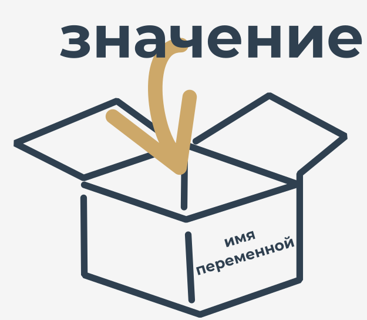

## Что такое переменные?

Итак, вы узнали, что Python позволяет кодировать литеральные данные, содержащие числа и текстовые значения.

Вы также знаете, что можете выполнять некоторые арифметические операции с этими числами: складывать, вычитать и т.д. Вы будете делать это много раз.

Возникает вопрос, как **сохранить результаты** этих операций, чтобы использовать их в других операциях и т.д.

Как сохранить промежуточные результаты и использовать их снова для получения последующих?

Python поможет вам в этом. Для этого он предлагает специальные «ящики» (контейнеры), и эти ящики называются **переменными** - само название предполагает, что содержимое этих контейнеров может меняться почти любым способом.

Что есть в каждой переменной Python?

* Имя;
* Значение (содержимое контейнера).

Давайте начнем с вопросов, связанных с именем переменной.

Переменные не появляются в программе автоматически. Как разработчик, вы должны решить, сколько и какие переменные будут использованы в ваших программах.

Вы также должны дать им названия.

Если вы хотите **дать имя переменной**, вы должны соблюдать некоторые строгие правила:

* Имя переменной должно состоять из прописных или строчных букв, цифр и символа `_` (подчеркивание);
* Имя переменной должно начинаться с буквы;
* Символ подчеркивания - это буква;
* Прописные и строчные буквы обрабатываются как разные (иначе, чем в реальном мире - _Alice_ и _ALICE_ - это те же
  Имена, но в Python это два разных имени переменных и, следовательно, две разные переменные);
* Имя переменной не должно быть одним из зарезервированных слов Python (ключевые слова - мы скоро расскажем об этом подробнее).



## Правильные и неправильные имена переменных

Обратите внимание, что к именам функций применяются те же ограничения.

Python не накладывает ограничений на длину имен переменных, но это не значит, что длинное имя переменной всегда лучше короткого.

Вот некоторые правильные, но не всегда удобные имена переменных:

`MyVariable`, `i`, `t34`, `Exchange_Rate`, `counter`, `days_to_christmas`
, `TheNameIsSoLongThatYouWillMakeMistakesWithIt`, `_`.

Кроме того, Python позволяет использовать не только латинские буквы, но и символы, специфичные для языков, использующих другие алфавиты.

Перечисленные имена переменных также правильны:

`Adiós_Señora`, `sûr_la_mer`, `Einbahnstraße`, `переменная`.

А вот примеры некоторых **неправильных имен переменных**:

`10t` (не начинается с буквы), `Exchange Rate` (содержит пробелы)

**Примечание**

[PEP 8 - Руководство по стилю для кода Python](https://www.python.org/dev/peps/pep-0008/) 

Рекомендации по созданию имен для переменных и функций в Python:

* Имена переменных должны быть строчными, слова должны быть разделены подчеркиванием для улучшения читабельности (например, `var`, `my_variable`)
* Имена функций соответствуют тому же соглашению, что и имена переменных (например, `fun`, `my_function`)
* Также можно использовать смешанный регистр (например, `myVariable`), но только в тех случаях, когда это уже преобладающий стиль, чтобы сохранить обратную совместимость с принятым соглашением.

## Ключевые слова

Посмотрите на список слов, которые играют особую роль в каждой программе Python.

```
['False', 'None', 'True', 'and', 'as', 'assert', 'break', 'class', 'continue', 'def', 'del', 'elif', 'else', 'except', 'finally', 'for', 'from', 'global', 'if', 'import', 'in', 'is', 'lambda', 'nonlocal', 'not', 'or', 'pass', 'raise', 'return', 'try', 'while', 'with', 'yield']
```  

Они называются **ключевыми словами** или, точнее, **зарезервированными ключевыми словами**. Они зарезервированы, **вы не должны использовать их в качестве имен**: ни для своих переменных, ни для функций, ни для любых других именованных
объектов.

Значение зарезервированного слова **предопределено**, и его нельзя изменять никаким образом.

К счастью, из-за того, что Python чувствителен к регистру, вы можете изменить любое из этих слов, изменив регистр любой буквы, создав тем самым новое слово, которое больше не зарезервировано.

Например, **вы не можете назвать** свою переменную следующим образом:

```
import
```

Вы не должны иметь переменную с таким именем - это запрещено. Но вместо этого вы можете записать её так:

```
Import
```

Эти слова могут быть для вас загадкой, но вы скоро поймете их значение.

## Создание переменных

Что вы можете поместить в переменную?

Все, что угодно.

Вы можете использовать переменную для хранения значения любого из уже представленных видов, а также множества других, которые вы пока еще не видели.

Значение переменной - это то, что вы положили в нее. Ее значение может меняться так часто, как вам нужно. В одно мгновение это может быть целое число, а через мгновение - число с плавающей запятой, которое в итоге становится строкой.

Давайте теперь поговорим о двух важных вещах - **как создаются переменные** и **как помещать в них значения** (или, скорее, как давать или **передавать значения** им).

**Обратите внимание**

**Переменная возникает в результате присвоения ей значения**. В отличие от других языков, вам не нужно объявлять это каким-либо особым образом.

Если вы присвоите какое-нибудь значение несуществующей переменной, переменная будет **автоматически создана**. Вам не нужно больше ничего делать.

Создание (или синтаксис) чрезвычайно просто: **введите имя нужной переменной, затем знак равенства (=) и значение, которое вы хотите поместить в переменную.**


Посмотрите на фрагмент:

```python
var = 1
print(var)
```

Он состоит из двух простых частей:

* Первая из них создает переменную с именем `var` и назначает литеральную константу с целочисленным значением,  равным `1`;
* Вторая выводит значение вновь созданной переменной в консоль.

**Примечание**: `print()` также может обрабатывать переменные. Подумайте, что вы увидите при выводе фрагмента на консоль?

<details><summary>Проверка</summary>

`1`

</details>


## Использование переменных

Вы можете использовать столько объявлений переменных, сколько вам нужно для достижения своей цели, например:

```python
var = 1
account_balance = 1000.0
client_name = 'John Doe'
print(var, account_balance, client_name)
print(var)
```

Однако нельзя использовать переменную, которая не существует (другими словами, переменную, которой не было присвоено значение).

Этот пример **показывает ошибку**:

```python
var = 1
print(Var)
```

Мы попытались использовать переменную с именем `Var`, которая не имеет никакого значения (примечание: `var` и `Var` различаются и не имеют ничего общего в Python).

**Обратите внимание**

Вы можете использовать оператор `print()` и комбинировать текст и переменные с помощью оператора `+` для вывода строк и переменных, например:

```python
var = "3.8.5"
print("Python version: " + var)
```

Можете ли вы угадать вывод вышеуказанного фрагмента?

<details><summary>Проверка</summary>

`Python version: 3.8.5`

</details>


## Присвоение нового значения уже существующей переменной

Как назначить новое значение для уже созданной переменной? Точно так же. Вам просто нужно использовать знак равенства.

Знак равенства на самом деле является **оператором присваивания**. Хотя это может показаться странным, оператор имеет простой синтаксис и однозначную интерпретацию.

Он назначает значение своего правого аргумента слева, тогда как правый аргумент может быть произвольно сложным выражением, включающим литеральные данные, операторы и уже определенные переменные.

Посмотрите на код ниже:

```python
var = 1
print(var)
var = var + 1
print(var)
```

Код отправляет две строки на консоль:

```
1
2
```

Первая строка фрагмента **создает новую переменную** с именем `var` и присваивает ей значение `1`.

Инструкция гласит: присвойте значение `1` переменной с именем `var`.

Можно сказать короче: назначьте `1` для `var`.

Некоторые предпочитают читать такое утверждение как: `var` становится `1`.

Третья строка **назначает ту же переменную с новым значением**, взятым из самой переменной, суммированным с `1`. Видя такую запись, математик, вероятно, возразил бы - никакое значение не может быть равно самому себе плюс единица. Это противоречие. Но Python обрабатывает знак `=` не как _равно_, а как _присвоение значения_.

Итак, как вы прочитаете такую запись в программе?

Возьмите текущее значение переменной `var`, добавьте к нему `1` и сохраните результат в переменной `var`.

По сути, значение переменной `var` было **увеличено** на единицу, но это никак не связано с присвоением переменной другого значения.

Подумайте, каким будет результат вывода следующего фрагмента кода?

```python
var = 100
var = 200 + 300
print(var)
```

<details><summary>Проверка</summary>

`500` Почему? Ну, во-первых, переменная `var` создается и ей присваивается значение 100. Затем этой же переменной присваивается новое значение: результат сложения 200 к 300, что составляет 500.

</details>


## Решение простых математических задач

Теперь у вас должна быть возможность составить короткую программу, решающую простые математические задачи, такие как теорема Пифагора:

_Квадрат гипотенузы равен сумме квадратов катетов._

Следующий код вычисляет длину гипотенузы (то есть самую длинную сторону прямоугольного треугольника, противоположную прямому углу), используя теорему Пифагора:

```python
a = 3.0
b = 4.0
c = (a ** 2 + b ** 2) ** 0.5
print("c =", c)
```

**Примечание**: нам нужно использовать оператор `**` для вычисления квадратного корня как:


и


Можете ли вы угадать каким будет вывод кода?

Проверьте ниже и запустите код в редакторе, чтобы подтвердить ваши прогнозы.

<details><summary>Проверка</summary>

`c = 5.0`

</details>

