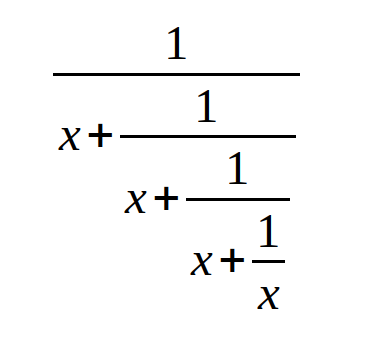

## Задачи 

* ознакомиться с концепцией чисел, операторов и арифметических операций в Python;

## Сценарий

```python
x = float(input("Введите значение x: "))

# напишите ваш программный код здесь

print("y =", y)

```

Ваша задача - завершить код, чтобы оценить следующее выражение:

  

Результат должен быть присвоен `y`. Будьте осторожны - следите за операторами и помните их приоритеты. Не стесняйтесь использовать столько скобок, сколько вам нужно.

Вы можете использовать дополнительные переменные для сокращения выражения (но это не обязательно). Тщательно протестируйте свой код.

  
## Тестовые данные

Пример ввода: `1`

Ожидаемый результат: `y = 0.6000000000000001`  

Пример ввода: `10`

Ожидаемый результат: `y = 0.09901951266867294`  

Пример ввода: `100`

Ожидаемый результат: `y = 0.009999000199950014`  

Пример ввода: `-5`

Ожидаемый результат: `y = -0.19258202567760344`  

